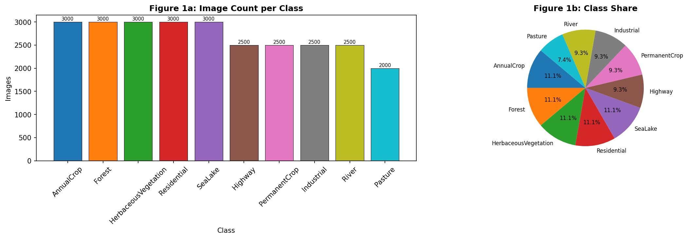
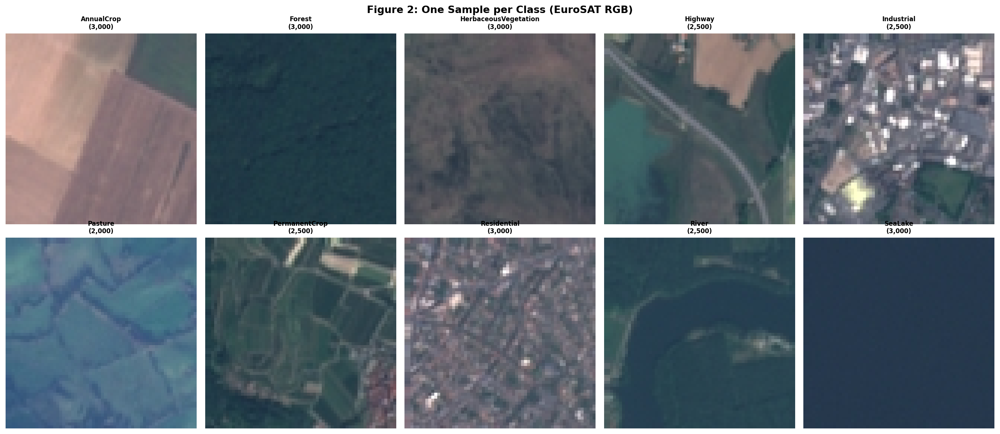
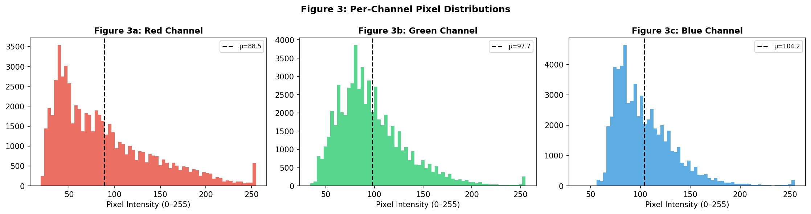
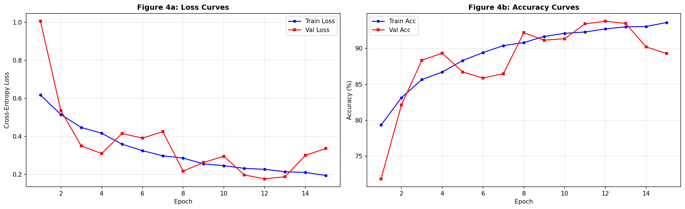
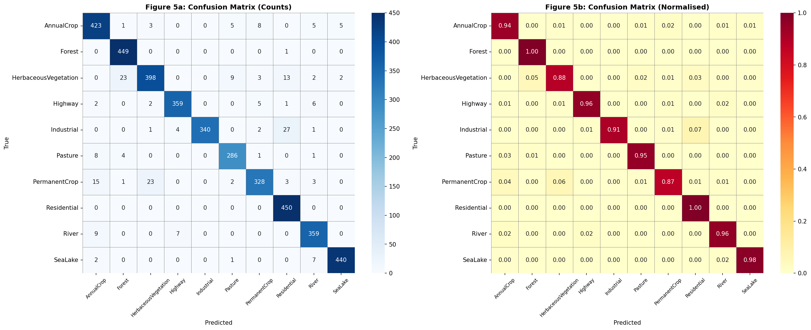
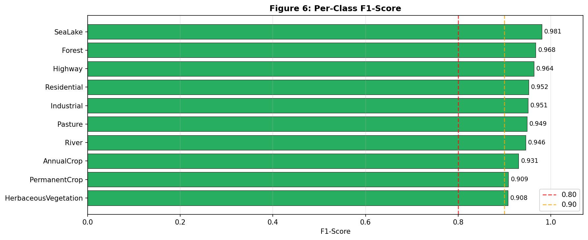
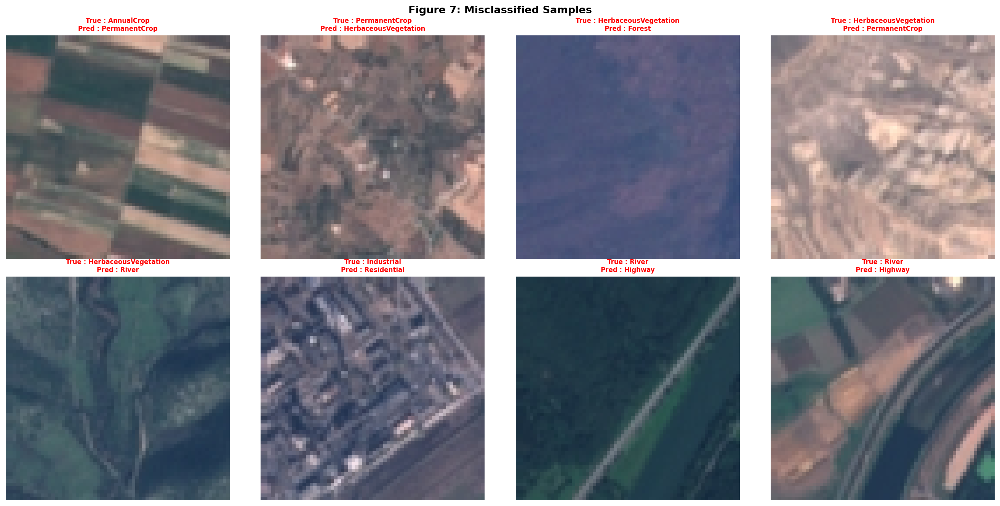
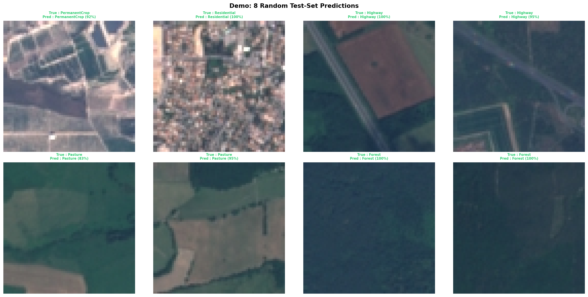

# 🛰️ EuroSAT — Satellite Land-Use Classification System

> **Deep Learning Lab (AI335L) | OEL Project**
> Muhammad Bilal Asif · S2024CS005 · BS Computer Sciences (5th Semester)
> NASTP Institute of Information Technology

---

## 📌 Overview

An end-to-end deep learning pipeline that classifies **Sentinel-2 satellite image patches** into one of **10 land-use categories** using a custom-built CNN. Given any 64×64 RGB satellite patch, the system outputs the predicted land type along with a confidence score.

**Test Accuracy: ~94%** · **Macro F1-Score: ~0.946** · **10 Classes** · **27,000 Images**

---

## 🗂️ Repository Structure

```
eurosat-classification/
│
├── data/                          # Data directory (not tracked by git)
│   └── EuroSAT_RGB/               # Raw EuroSAT dataset
│       ├── AnnualCrop/
│       ├── Forest/
│       ├── HerbaceousVegetation/
│       ├── Highway/
│       ├── Industrial/
│       ├── Pasture/
│       ├── PermanentCrop/
│       ├── Residential/
│       ├── River/
│       └── SeaLake/
│
├── models/                        # Saved model checkpoints
│   └── eurosat_cnn.pth            # Trained model weights
│
├── figures/                       # Output figures and visualisations
│   ├── fig1_class_dist.png        # Class distribution (bar + pie)
│   ├── fig2_samples.png           # One sample per class
│   ├── fig3_pixels.png            # Per-channel pixel distributions
│   ├── fig4_curves.png            # Training loss & accuracy curves
│   ├── fig5_cm.png                # Confusion matrices (counts + normalised)
│   ├── fig6_f1.png                # Per-class F1-scores
│   ├── fig7_misclassified.png     # Misclassified sample examples
│   ├── demo_predictions.png       # 8 random test-set predictions
│   └── prediction_result.png     # Single-image prediction demo
│
├── EuroSAT_Complete_System.ipynb  # Main Jupyter notebook (full pipeline)
├── EuroSAT_Complete_System.html   # Exported HTML version of notebook
├── requirements.txt               # Python dependencies
├── .gitignore                     # Git ignore rules
└── README.md                      # This file
```

---

## 🧠 Model Architecture — EuroSATCNN

```
Input (3 × 64 × 64)
     │
     ├── Block 1: Conv(3→32)   → BN → ReLU → Conv(32→32)   → BN → ReLU → MaxPool(2×2)
     ├── Block 2: Conv(32→64)  → BN → ReLU → Conv(64→64)   → BN → ReLU → MaxPool(2×2)
     ├── Block 3: Conv(64→128) → BN → ReLU → Conv(128→128) → BN → ReLU → MaxPool(2×2)
     ├── Block 4: Conv(128→256)→ BN → ReLU → Conv(256→256) → BN → ReLU → MaxPool(2×2)
     │
     ├── Global Average Pooling  →  (256,)
     ├── FC(256 → 128) → ReLU → Dropout(0.4)
     └── FC(128 → 10)  →  Softmax
```

| Component       | Choice                        | Justification                             |
|-----------------|-------------------------------|-------------------------------------------|
| Architecture    | Custom CNN (4 double-conv blocks) | Spatial feature learning for image patches |
| Activation      | ReLU                          | Avoids vanishing gradient                |
| Normalisation   | BatchNorm                     | Training stability                        |
| Regularisation  | Dropout(0.4) + Augmentation + L2 | Multi-pronged overfitting control      |
| Loss            | CrossEntropyLoss              | Standard multi-class                      |
| Optimizer       | AdamW lr=1e-3, wd=1e-4        | Decoupled weight decay                    |
| Scheduler       | ReduceLROnPlateau p=3         | Adapts LR to plateaus                     |
| Epochs          | Fixed 15                      | Sufficient convergence; reproducible      |

---

## 📊 Dataset

**EuroSAT RGB** — 27,000 Sentinel-2 patches at 64×64 pixels across Europe.

| Class                 | Images | Share  |
|-----------------------|--------|--------|
| AnnualCrop            | 3,000  | 11.1%  |
| Forest                | 3,000  | 11.1%  |
| HerbaceousVegetation  | 3,000  | 11.1%  |
| Residential           | 3,000  | 11.1%  |
| SeaLake               | 3,000  | 11.1%  |
| Highway               | 2,500  | 9.3%   |
| PermanentCrop         | 2,500  | 9.3%   |
| Industrial            | 2,500  | 9.3%   |
| River                 | 2,500  | 9.3%   |
| Pasture               | 2,000  | 7.4%   |

- Imbalance ratio ≈ 1.5× → no oversampling required
- **Split:** 70% Train / 15% Validation / 15% Test (stratified)

---

## ⚙️ Pre-processing Pipeline

1. **Resize** to 64×64 (uniform size enforced)
2. **Normalise** using ImageNet μ/σ — standard for RGB satellite data
   - R: μ=0.485, σ=0.229 · G: μ=0.456, σ=0.224 · B: μ=0.406, σ=0.225
3. **Train-only augmentation:** random horizontal/vertical flip, ±15° rotation, colour jitter
4. **Zero leakage:** scalers fitted on train split only

---

## 📈 Results

### Per-Class F1-Scores

| Class                | F1-Score |
|----------------------|----------|
| SeaLake              | 0.981    |
| Forest               | 0.968    |
| Highway              | 0.964    |
| Residential          | 0.952    |
| Industrial           | 0.951    |
| Pasture              | 0.949    |
| River                | 0.946    |
| AnnualCrop           | 0.931    |
| PermanentCrop        | 0.909    |
| HerbaceousVegetation | 0.908    |

### Key Observations

- **Forest** and **SeaLake** achieve the highest recall — strong spectral signatures
- **AnnualCrop vs PermanentCrop** and **Highway vs River** are the main confusion pairs — visually similar textures
- Training and validation curves converge within 15 epochs
- Multi-pronged regularisation keeps the train–val gap small

---

## 🖼️ Visualisations

### Figure 1 — Class Distribution


### Figure 2 — Sample Images per Class


### Figure 3 — Per-Channel Pixel Distributions

*Channel means: R=88.5 · G=97.7 · B=104.2*

### Figure 4 — Training Curves


### Figure 5 — Confusion Matrix


### Figure 6 — Per-Class F1-Score


### Figure 7 — Misclassified Samples


### Demo — Random Test-Set Predictions


---

## 🚀 Getting Started

### Prerequisites

```bash
pip install -r requirements.txt
```

### Download the Dataset

```bash
# Option 1: via torchvision
python -c "from torchvision.datasets import EuroSAT; EuroSAT(root='./data', download=True)"

# Option 2: Manual download
# https://github.com/phelber/EuroSAT
```

### Run the Notebook

```bash
jupyter notebook EuroSAT_Complete_System.ipynb
```

### Run Inference on a Single Image

```python
import torch
from PIL import Image
from torchvision import transforms

# Load model
model = torch.load('models/eurosat_cnn.pth', map_location='cpu')
model.eval()

# Preprocess
transform = transforms.Compose([
    transforms.Resize((64, 64)),
    transforms.ToTensor(),
    transforms.Normalize([0.485, 0.456, 0.406],
                         [0.229, 0.224, 0.225])
])

img = Image.open('your_image.jpg').convert('RGB')
tensor = transform(img).unsqueeze(0)

# Predict
with torch.no_grad():
    output = model(tensor)
    probs = torch.softmax(output, dim=1)
    pred = probs.argmax().item()
    confidence = probs.max().item()

CLASSES = ['AnnualCrop','Forest','HerbaceousVegetation','Highway',
           'Industrial','Pasture','PermanentCrop','Residential','River','SeaLake']

print(f"Prediction: {CLASSES[pred]} ({confidence*100:.1f}% confidence)")
```

---

## 📦 requirements.txt

```
torch>=2.0.0
torchvision>=0.15.0
numpy>=1.24.0
matplotlib>=3.7.0
scikit-learn>=1.3.0
Pillow>=10.0.0
jupyter>=1.0.0
seaborn>=0.12.0
tqdm>=4.65.0
```

---

## ⚠️ Limitations & Future Work

1. **Only RGB used** — NIR/SWIR spectral bands would improve vegetation discrimination
2. **Transfer learning** (ResNet-50, EfficientNet-B0) would boost accuracy with fewer epochs
3. **Sliding-window wrapper** would extend the system to full Sentinel-2 scenes
4. **Test-Time Augmentation (TTA)** could improve confidence calibration
5. **Attention mechanisms** (CBAM, SE blocks) could improve fine-grained class boundaries

---

## 📄 License

This project is submitted as academic coursework for **AI335L Deep Learning Lab** at NASTP Institute of Information Technology. All rights reserved by the author.

---

## 👤 Author

**Muhammad Bilal Asif**
BS Computer Sciences · 5th Semester · Roll No: S2024CS005
NASTP Institute of Information Technology
Supervisor: Sir Haseeb

---

*Built with PyTorch · EuroSAT Dataset · Sentinel-2 Imagery*
